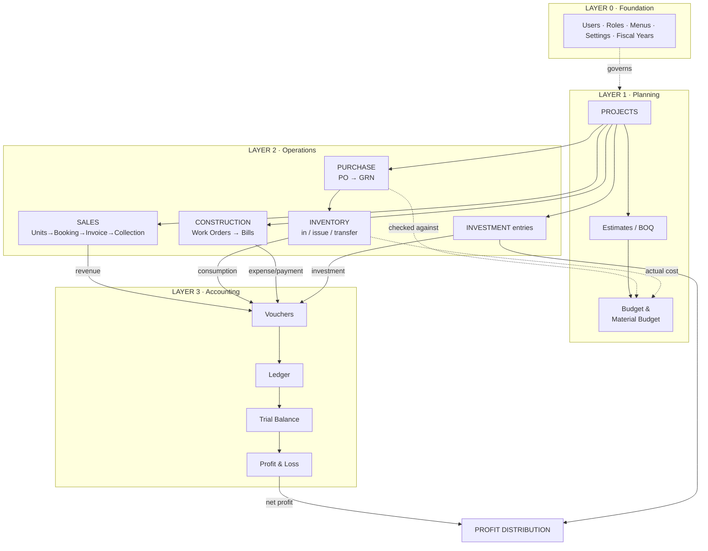

# ERP — System Architecture & Data Flow

A polished, layered view of how the modules fit together. Read top-to-bottom:
**setup** defines the rules, **operations** generate the activity, and everything
settles into the **accounting ledger** at the bottom.


> Per-module development & business flow docs (one page per `modules/` folder) live in
> [`modules/README.md`](modules/README.md).

---

## Layered overview

```
╔══════════════════════════════════════════════════════════════════════════════╗
║                          LAYER 0 · FOUNDATION                                  ║
║   Users · Roles · Menus · Audit Logs · System Settings · Fiscal Years          ║
║   (who can do what · global config · the period everything posts into)         ║
╚══════════════════════════════════════════════════════════════════════════════╝
                                     │
                                     ▼
╔══════════════════════════════════════════════════════════════════════════════╗
║                          LAYER 1 · PLANNING                                    ║
║                                                                                ║
║      ┌────────────┐      ┌──────────────┐      ┌────────────────────┐         ║
║      │  PROJECTS  │─────▶│ ESTIMATES /  │─────▶│  BUDGET TRACKER /  │         ║
║      │ (the spine)│      │  BOQ         │      │  MATERIAL BUDGET   │         ║
║      └─────┬──────┘      └──────────────┘      └─────────▲──────────┘         ║
║            │              budget baseline                │ checked against     ║
║            │  Blocks · Units · Setup Checklist           │                     ║
╚════════════╪════════════════════════════════════════════╪═════════════════════╝
             │                                             │
             ▼                                             │
╔════════════╪═════════════════════════════════════════════════════════════════╗
║            │             LAYER 2 · OPERATIONS            │                     ║
║            │                                             │                     ║
║  ┌─────────┴──────┐  ┌─────────────┐  ┌──────────────┐  │  ┌───────────────┐  ║
║  │     SALES      │  │  PURCHASE   │  │ INVENTORY    │──┘  │  CONSTRUCTION │  ║
║  │ Units→Booking  │  │  PO → GRN   │─▶│ in/issue/    │     │  Work Orders  │  ║
║  │ →Schedule      │  └─────────────┘  │ transfer     │     │  → Bills      │  ║
║  │ →Invoice       │                   └──────────────┘     └───────┬───────┘  ║
║  │ →Collection    │  ┌─────────────┐                               │          ║
║  └───────┬────────┘  │ INVESTMENT  │───────────────┐               │          ║
║          │           │  entries    │               │               │          ║
║          │           └─────────────┘               │               │          ║
╚══════════╪════════════════════════════════════════╪═══════════════╪══════════╝
           │ receipts /          consumption /       │ investment    │ expense /
           │ revenue             actual-cost         │               │ payment
           ▼                     ▼                    ▼               ▼
╔══════════════════════════════════════════════════════════════════════════════╗
║                          LAYER 3 · ACCOUNTING                                  ║
║                                                                                ║
║     VOUCHERS  ──▶  LEDGER  ──▶  TRIAL BALANCE  ──▶  PROFIT & LOSS              ║
║   (every action     (per         (debit=credit,      (revenue − expense        ║
║    becomes a         account)     reconciled)         = net profit)            ║
║    voucher)                                              │                     ║
╚══════════════════════════════════════════════════════════╪═════════════════════╝
                                                            │ net profit
                                                            ▼
                                          ┌────────────────────────────────┐
                                          │      PROFIT DISTRIBUTION        │
                                          │  net profit + investor shares   │
                                          │  → payouts to investors         │
                                          └────────────────────────────────┘
```

---

## Reading the layers

| Layer | Purpose | Pages |
|-------|---------|-------|
| **0 · Foundation** | Access control, global rules, the accounting period | Users, Roles, Menus, Audit Logs, System Settings, Fiscal Years |
| **1 · Planning** | Define projects and their budgets | Projects, Blocks, Units, Estimates/BOQ, Budget Tracker, Material Budget |
| **2 · Operations** | Day-to-day activity that generates money movement | Sales, Purchase, Inventory, Construction, Investment |
| **3 · Accounting** | Everything settles into the ledger | Vouchers, Ledger, Trial Balance, P&L, Profit Distribution |

**The single most important rule:** every operational action in Layer 2 — a
collection, a material issue, a work-order bill, an investment — is posted as a
**voucher** in Layer 3. The Ledger, Trial Balance and P&L are just different lenses
on those vouchers, and the Trial Balance **reconciliation** check proves Layer 2 and
Layer 3 still agree.

---

## Rendered view (Mermaid)



> See [PAGES_GUIDE.md](./PAGES_GUIDE.md) for the per-page reference and the
> step-by-step end-to-end walkthroughs that follow these flows.
