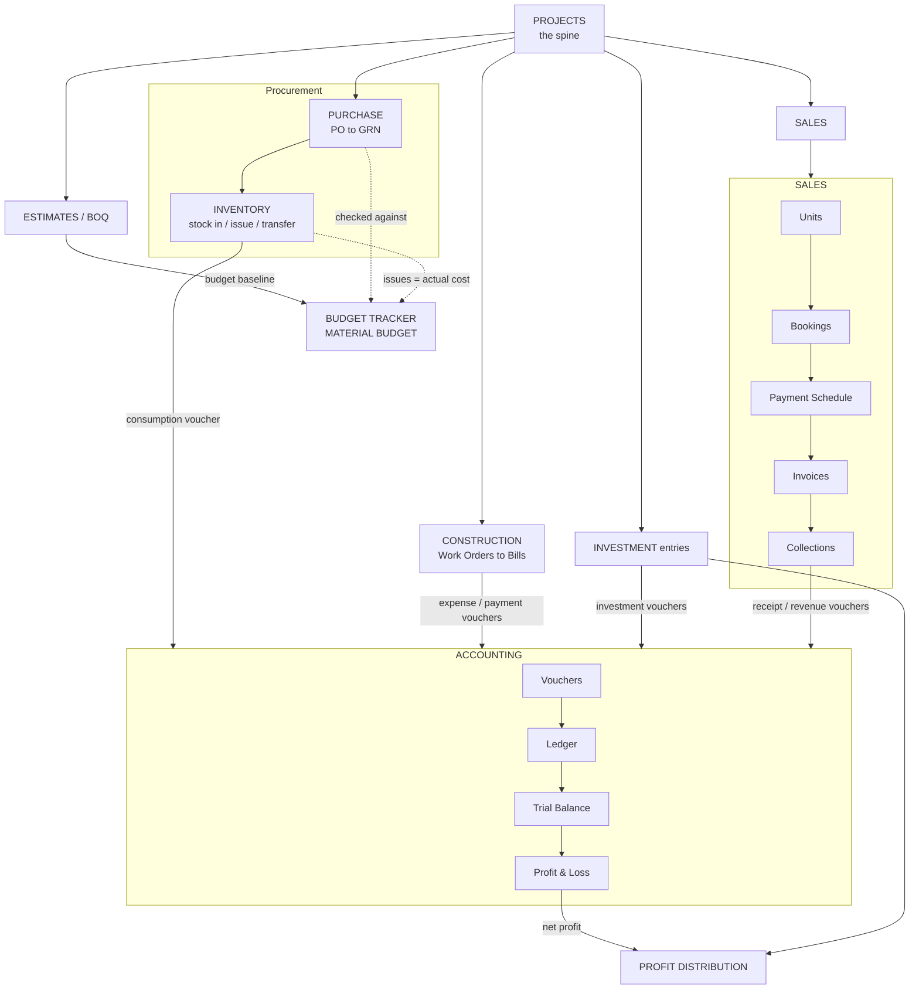

# ERP — Page-by-Page Feature Guide

A plain-language guide to every screen in the application. Pages are grouped by
module the way they appear in the sidebar. For each page: **what it's for** and
**the main flow / actions**.

This is a real-estate / construction ERP (housing developer). Money is shown in
Bangladeshi Taka (৳); "L" means lakh (1 lakh = 100,000).

---

## Auth

### Login — `/login`
Email + password sign-in. On success it stores the auth token and the user's
roles, then redirects into the dashboard. Has a "forgot password" link.

### Forgot Password — `/forgot-password`
Request a password-reset for an email address.

---

## Dashboard

### Dashboard — `/dashboard`
The landing overview. Pulls projects, invoices, payments, materials and bookings
and shows **KPI cards** (active projects, revenue, dues, low-stock count, etc.),
recent activity lists, and **charts** (loaded lazily). Read-only — it's a
snapshot of the whole business.

---

## Projects (Housing Projects)

### Projects — `/projects`
The master list of housing/development projects, shown as cards. Create/edit a
project (code, name, type, address, land area, estimated cost & revenue, dates,
status: Planning → Active → OnHold → Completed). Each card has:
- **Setup Checklist** — a staged onboarding guide (see below).
- Banner alerts when approved estimates are **over budget**, and a **material
  budget health** widget (over-budget / at-risk materials) linking to the
  budget trackers.

### Project Setup Checklist (modal on each project)
A 5-stage guided checklist (Project Setup → Budget Planning → Procurement →
Site Execution → Sales). Each step shows whether it's complete, a count, and a
link to the page where you do it. Helps a new project get fully configured.

### Blocks — `/projects/blocks`
Buildings/blocks within a project (name, planned floors, area breakdown, description).
Floors live inside blocks, and units live inside floors. Shows floors created vs planned
and how many units each block has.

### Floors — `/projects/floors`
Floors within a block (name, floor number, area breakdown, description). Every unit
belongs to a floor, so a block needs its floors before its units can be added. Shows how
many units sit on each floor.

### Cost Estimates / BOQ — `/estimates`
The **Bill of Quantities** (budget estimate). Each estimate has versioned line items
grouped by trade category (Civil, Structural, Electrical, Plumbing, HVAC, Finishing,
etc.) with quantity × rate = estimated amount, plus actuals. Estimates move
Draft → Approved → Revised/Rejected. This is the budget baseline everything else is
compared against. Lines can be linked to materials.

An estimate is **scoped** to one level of the hierarchy — the whole project, a single
block, a single floor, or a single unit. Leave a level blank in the scope picker to
cover everything below it. Because the full ancestor chain is stored, filtering the
list by a block also shows the floor- and unit-scoped estimates inside it. A project
can hold estimates at several levels at once; totals sum them all, so take care not to
budget the same work twice.

### Budget Tracker — `/budget`
Read-mostly view comparing **estimated vs actual** cost (from approved estimates),
highlighting overruns. Filterable down to a block, floor or unit. This is where the
"Budget Overrun Alert" on the Projects page points.

### Material Budget — `/material-budget`
Per-material budget tracking: budgeted qty/cost vs **committed** (ordered via POs) vs
**actual** (issued to site), with a utilisation % and a status of within / approaching
/ exceeded budget. Prevents material overspend. Narrowing below project level filters
the **budget** side only — purchase orders and stock issues are recorded against the
project, so committed and actual figures stay project-wide.

---

## Sales

### Clients — `/sales/clients`
Customer master (buyers). Code, name, mobile, email, address, NID, profession,
nominee, status. Create/edit clients.

### Units — `/projects/units`
Sellable units (flats/apartments) inside a project's block. Unit no, floor (picked from
the block's floors), type, facing, area (sqft). Base price is computed as area × the
selling rate per sqft from the rate card, not typed — tick Override for a negotiated
one-off, which is recorded and flagged as such. Additional charges are named lines
(parking, utility, corner, floor premium) whose sum is the additional price; base +
additional = total. Status: Available → Booked → Sold → Cancelled.

The **Rate Cards** button manages the selling rates. A rate is scoped to a project and
can be narrowed to a block, floor or unit type — the most specific card wins. Rates are
effective-dated, and publishing a new one closes the previous, so past prices stay
explainable. A project with no rate card cannot price units.

### Bookings — `/sales/bookings`
Records a customer booking a unit. Captures booking amount, discount, net amount,
and an **installment plan**. You can auto-generate an even installment schedule or
build a **custom uneven schedule** (must sum to the financed amount = total − discount
− booking). Booking a unit marks it Booked. Can be cancelled.

### Payment Schedule — `/sales/schedules`
The list of all **installments** due across bookings (No., due date, amount, paid,
due, penalty, status: Paid/Partial/Unpaid/Overdue). From here you can **generate an
invoice** for a due installment in one click.

### Invoices — `/sales/invoices`
Customer invoices (installment or other types). Sub-total, discount, VAT, tax →
total, with paid/due tracking and status (Draft/Sent/Paid/Overdue/Cancelled).
Can be **printed**.

### Collections (Payments) — `/sales/collections`
Records money received from customers against invoices. Method (Cash/Bank/Cheque/
Online), reference, cheque details. Warns if a payment isn't linked to an invoice.
Receipts can be **printed**; includes a small collections chart.

---

## Purchase

### Vendors — `/purchase/vendors`
Supplier/contractor master. Type = Supplier, Contractor, or Both (contractors here
feed the Work Orders contractor dropdown). BIN/TIN, contact details. Has a **vendor
history** modal.

### Purchase Orders — `/purchase`
Create POs to buy materials from a vendor for a project. Multi-line item grid
(material, qty, unit price). Validates lines against the project's **material budget**
— unmatched/over-budget items require a reason (or are blocked, per system setting).
POs go Draft → Approved → Received.

### GRN (Goods Receipt) — `/purchase/grn`
Records receiving goods against an **approved PO**. Pre-fills the PO's items; you
enter received qty and unit cost per line. Receiving updates stock and the PO status.

---

## Inventory

### Resource Master — `/inventory/resources`
The single catalogue for everything a project consumes, filtered by **resource type**:
**Material** (stockable), **Equipment** (plant, owned or hired), **Service** (bought-in work)
and **Labour** (trades). Code, name, category, unit, rate basis and standard rate apply to all
types; reorder level, average cost and current stock apply to Materials only and show `—`
for the rest.

Replaces the old Material Master page (`/inventory/materials`), which was removed — it was a
strict subset of this screen. Material Substitutions were removed with it.

### Resource Rates — `/inventory/resource-rates`
Effective-dated rates per resource, optionally scoped to a vendor. Adding a rate automatically
closes the previous open rate for the same resource+vendor, so rates never overlap and the old
price is kept as history. Resolution order when a document asks for a rate:
**vendor rate → standard rate → resource standard rate → average cost**.

### Stock In — `/inventory/stock-in`
Manually record stock receipts into a warehouse (material, qty, unit cost, date,
reference). Used for stock not coming through a PO/GRN.

### Issue to Project — `/inventory/issue`
Issue material **out** of stock to a project (consumption). Checks available stock
and can warn against the project's material budget. This drives "actual" material cost.

### Warehouses — `/inventory/warehouses`
Manage warehouses/stores (name, location, active flag).

### Stock Transfer — `/inventory/transfer`
Move a quantity of a material from one warehouse to another.

### Stock Levels (central) — `/inventory`
Real-time stock per material in the central store, with **low-stock alerts** and
total stock value.

### Stock Levels (per-warehouse) — `/inventory/levels`
Per-warehouse balances for each material with a company-wide roll-up; filterable by
warehouse, flags low stock.

---

## Construction

### Work Orders — `/construction/work-orders`
Subcontractor contracts. Each work order = a contractor hired for a project for a
contract amount, with advance and a **retention %** held back from every bill.
Draft → Approve → Active. Per order you manage **progress bills** (contractor bills
as work proceeds): each bill auto-computes retention and net payable, goes Pending →
Approved, and an approved bill can generate an **Expense voucher** and a **Payment
voucher** into the accounting module.

---

## Accounting

### Chart of Accounts — `/accounting`
The account tree (Asset/Liability/Equity/Revenue/Expense), hierarchical with levels,
opening balances, posting vs header accounts, system-locked accounts. Create/edit
accounts.

### Vouchers — `/accounting/vouchers`
Manual journal entries. Voucher types: Journal (JV), Payment (PV), Receipt (RV),
Contra (CV), Bank (BV). Multi-line debit/credit grid that must balance; lines can be
tagged to a project. Vouchers are Draft → Posted; includes a view modal. Many
vouchers are auto-created from other modules (e.g. work-order bills, collections).

### Account Ledger — `/accounting/ledger`
Pick an account → see all posted transactions with running balance (opening →
movements → closing).

### Profit & Loss — `/accounting/pl`
Revenue vs expenses (from posted vouchers) → net profit/loss summary.

### Trial Balance — `/accounting/trial-balance`
All account balances with total debit = total credit, plus a **reconciliation banner**
that cross-checks ledger totals against the source modules (sales, purchase, etc.).

### Fiscal Years — `/accounting/fiscal-years`
Define accounting years (name, start/end) and **close** them (locks vouchers in that
period). Shows voucher count and who closed it.

---

## Investment

### Investors — `/investment/investors`
Investor master (MD, Chairman, Director, Partner, Shareholder…). Contact details,
status, and total amount invested.

### Investment Entries — `/investment/entries`
Record an investor putting money into a project (date, amount, payment mode, reference).
Entries can be **reversed** with a reason.

### Investment Report — `/investment/report`
Summaries: total invested **by project** and **by investor** (with share %), grand
total, and an **ROI view** (invested vs distributed per investor).

### Profit Distribution — `/investment/distribution`
Declare and distribute a project's profit to investors. Pick a project, choose the
profit basis (accounting vs cash/collected) and the share basis (snapshot of holdings),
**preview** each investor's share, optionally override amounts and pick a rounding
rule, then declare. Generates per-investor payout lines/vouchers. (Some actions are
restricted to super-admin.)

---

## Reports

### Reports (hub) — `/reports`
Tabbed operational reports (project summary, sales, purchase, inventory, etc.),
printable.

### AR Aging — `/reports/ar-aging`
Outstanding customer invoices bucketed by how overdue they are (Current, 1-30,
31-60, 61-90, 90+ days), with total outstanding. Optional "as-of" date.

### Collection Pipeline — `/reports/collection-pipeline`
Per-booking collection progress: net amount vs collected vs outstanding, installment
counts (paid/overdue). Filter by project.

### Material Consumption — `/reports/material-consumption`
Per-material received vs issued vs balance qty and issued value, filterable by project
and date range.

### Work Order Progress — `/reports/work-order-progress`
Per work order: contract amount, billed, paid, retention held, advance given/recovered,
% billed. Filter by project.

### Cost Variance — `/reports/cost-variance`
Estimated vs actual by cost category, with variance amount and %. Covers **every** approved
estimate for the selected scope, so a project holding both a project-wide and a unit-scoped
estimate sees both. Filterable down to a block, floor or unit.

### Trial Balance — see Accounting above (also linked from reports).

---

## Administration

### Users — `/users`
Manage system users: name, email, phone, **role(s)**, active toggle, reset password.
Shows an **effective-access preview** (what modules a role combination can see/do).

### Roles — `/roles`
Define roles and their **menu permissions** (per menu: view/create/edit/delete).
Built-in roles: super_admin, operations, inventory, engineer, etc.

### Menus — `/menus`
Manage the navigation menu tree (name, code, route, icon, parent, sort order, active).
Drives what appears in the sidebar; ties into role permissions.

### Audit Logs — `/audit-logs`
Read-only trail of Create/Update/Delete actions across all tables (who, when, IP,
old vs new values). Searchable/filterable by table and action.

### Tasks — `/tasks`
A Kanban board of project tasks (Pending → In Progress → Review → Done) with priority,
assignee, project, and dates.

---

## Settings

### My Settings — `/settings`
Personal profile (name, phone), change password, and notification preferences (tabbed).

### System Settings — `/settings/system`
Company-wide configuration toggles, e.g.:
- **Revenue Recognition Basis** — Cash (on collection) vs Invoice (accrual).
- **Purchase EPL Enforcement** — Warn (capture reason) vs Block unmatched material
  purchases.

---

### Common patterns (apply to most pages)
- **Search bar + filters** at the top of list pages; a **Refresh** button.
- **Summary/KPI cards** above the table.
- **Modal forms** for create/edit, validated with Zod (required fields marked *).
- **Status badges** with consistent colours, and an **Approve** action where a record
  has a Draft → Approved/Active lifecycle.
- Data is fetched via a shared `useApiData` hook against the backend REST API.

---

## How the modules connect

The modules are not independent — data flows from project setup through to the
ledger. The diagram below shows the main dependencies (arrows = "feeds into").

```
                          ┌──────────────┐
                          │   PROJECTS   │  (the spine — everything tags to a project)
                          └──────┬───────┘
        ┌────────────────────────┼─────────────────────────┐
        ▼                        ▼                          ▼
 ┌─────────────┐         ┌──────────────┐           ┌──────────────┐
 │  ESTIMATES  │         │  INVESTMENT  │           │    SALES     │
 │  (BOQ)      │         │   entries    │           │              │
 └──────┬──────┘         └──────┬───────┘           │ Units→Booking│
        │ budget baseline       │                   │  →Schedule   │
        ▼                       │                   │  →Invoice    │
 ┌─────────────────┐            │                   │  →Collection │
 │ BUDGET TRACKER  │            │                   └──────┬───────┘
 │ MATERIAL BUDGET │◄───┐       │                          │
 └─────────────────┘    │       │                          │
        ▲ checked by    │       │                          │
        │               │       │                          │
 ┌──────┴──────┐  ┌──────┴────┐ │                          │
 │  PURCHASE   │  │ INVENTORY │ │                          │
 │ PO → GRN    │─►│ stock in/ │ │                          │
 └─────────────┘  │ issue/    │ │                          │
 ┌─────────────┐  │ transfer  │ │                          │
 │ CONSTRUCTION│  └───────────┘ │                          │
 │ Work Orders │                │                          │
 │ → Bills     │                │                          │
 └──────┬──────┘                │                          │
        │ expense/payment       │ profit shares            │ receipts/revenue
        ▼ vouchers              ▼ vouchers                 ▼ vouchers
 ┌───────────────────────────────────────────────────────────────────┐
 │                          ACCOUNTING                                 │
 │   Vouchers → Ledger → Trial Balance → Profit & Loss                 │
 │   (P&L net profit feeds back into → PROFIT DISTRIBUTION)            │
 └───────────────────────────────────────────────────────────────────┘
```

### Rendered diagram (Mermaid)



**The key idea:** almost every operational action (a collection, a material issue,
a work-order bill, an investment) ends up as a **voucher** in Accounting. The
ledger, trial balance and P&L are just different views of those vouchers. The
**Trial Balance reconciliation banner** exists to confirm the source modules and
the ledger still agree.

---

## End-to-end walkthroughs

These show how the pages chain together for the main business processes.

### A. Standing up a new project
1. **Projects → New Project** — create the project (code, name, estimated cost/revenue).
2. Open its **Setup Checklist** to see the remaining stages.
3. **Blocks** — add the building blocks; **Floors** — add each block's floors;
   **Units** — add the sellable flats onto those floors.
4. **Estimates** — build the BOQ (budget), choosing whether it covers the whole project
   or just one block, floor or unit, then **Approve** it. This becomes the
   baseline for Budget Tracker, Material Budget and Cost Variance.

### B. Procure-to-stock (buying materials)
1. **Materials** — make sure each material exists in the catalogue.
2. **Purchase → New PO** — order materials from a vendor for the project. Lines are
   checked against the **Material Budget**; unmatched items need a reason (or are
   blocked, per System Settings).
3. **Approve** the PO.
4. **GRN** — receive goods against the approved PO (received qty + unit cost). This
   raises stock and updates average cost.
5. Verify in **Stock Levels**.

### C. Issue material to site (consumption)
1. **Inventory → Issue to Project** — issue material out to the project.
2. This becomes the project's **actual** material cost, visible in **Material Budget**
   and **Cost Variance**, and consumes stock (low-stock alerts trigger if needed).
3. Optionally use **Stock Transfer** to move material between warehouses first.

### D. Subcontractor work (Work Orders)
1. **Construction → New Work Order** — contract a contractor (from Vendors, type
   Contractor/Both) with contract amount, advance, retention %. **Approve** → Active.
2. As work progresses, open the order's **Bills** and **Add Progress Bill**; the
   system holds back retention and computes net payable. **Approve** the bill.
3. From the approved bill, create an **Expense Voucher** (records the cost) and a
   **Payment Voucher** (records paying the contractor) — both land in Accounting.
4. Track overall status in **Reports → Work Order Progress**.

### E. Sell a unit and collect money
1. **Clients** — add the buyer.
2. **Bookings → New Booking** — book an Available unit; set booking amount, discount,
   and the installment plan (even or custom). The unit becomes Booked.
3. **Payment Schedule** — when an installment is due, **generate an invoice** for it.
4. **Invoices** — review/print the invoice.
5. **Collections** — record the customer's payment against the invoice (Cash/Bank/
   Cheque/Online); print a receipt. Revenue posts to Accounting per the
   **Revenue Recognition Basis** in System Settings.
6. Monitor **Reports → AR Aging** and **Collection Pipeline** for what's outstanding.

### F. Investment and profit distribution
1. **Investors** — add the investors.
2. **Investment → Entries** — record each investor's money into a project.
3. **Investment → Report** — see totals by project/investor and ROI.
4. When a project is profitable, **Profit Distribution** — pick the project, choose
   profit & share basis, **preview** each investor's share, adjust/round if needed,
   then declare. Payout lines/vouchers are generated. (Super-admin gated.)

### G. Month/period close (Accounting)
1. Day-to-day, most vouchers are created automatically by modules B–F above; use
   **Vouchers** for manual journal entries.
2. **Account Ledger** — drill into any account's transactions.
3. **Trial Balance** — confirm debits = credits and the **reconciliation** checks pass.
4. **Profit & Loss** — review revenue vs expense and net profit.
5. **Fiscal Years** — close the period to lock its vouchers.
